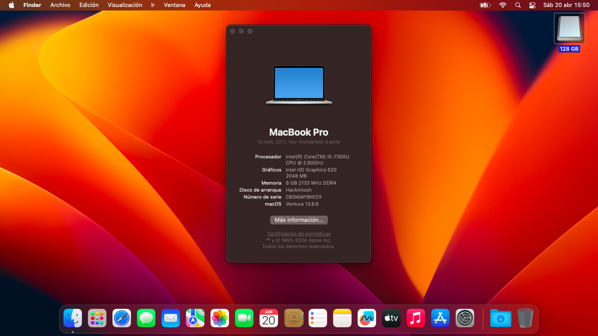

# EFI Opencore - Lenovo Thinkpad X270

<div align="center">



**Fully working EFI for Lenovo Thinkpad X270 with macOS Ventura**

[](https://github.com/acidanthera/OpenCorePkg)
[](https://www.apple.com/macos/ventura/)

**English** | [Español](README_ES.md)

</div>

---

## 📋 Hardware Specifications

| Component | Details |
|-----------|---------|
| **Model** | Lenovo Thinkpad X270 |
| **CPU** | Intel Core i5-6300U @ 2.50GHz (Skylake) |
| **GPU** | Intel HD Graphics 520 |
| **RAM** | 16 GB DDR4 @ 2133MHz |
| **Screen** | 12.4" IPS (1366x768) |
| **Wi-Fi** | Intel AC-8260 |
| **Ethernet** | Intel I219-LM |
| **Audio** | Realtek ALC298 |
| **Camera** | 720p HD Camera |
| **Battery** | 3-cell internal + external battery |
| **Storage** | NVMe/SATA SSD |

---

## ✅ What's Working

- ✅ **Graphics**: Intel HD 520 with full acceleration (QE/CI)
- ✅ **CPU**: Power Management with native XCPM
- ✅ **Battery**: Full battery management and status
- ✅ **USB**: All USB 3.0 ports (mapped with USBMap.kext)
- ✅ **Display**: HDMI output with audio
- ✅ **Network**: Intel Ethernet I219-LM
- ✅ **Audio**: Realtek ALC298 (speakers + headphone jack)
- ✅ **Camera**: 720p webcam + FaceTime
- ✅ **Trackpad**: Full gestures support (tap to click enabled)
- ✅ **Keyboard**: All keys including Fn functions
- ✅ **Wi-Fi & Bluetooth**: Intel AC-8260 with AirportItlwm
- ✅ **Apple Services**: iMessage, FaceTime, App Store, iCloud
- ✅ **DRM**: iTunes, Apple TV+, Netflix, Amazon Prime
- ✅ **SD Card Reader**: Working (slightly unstable in v2.2)
- ✅ **Sleep/Wake**: Lid sleep and wake functional
- ✅ **Shutdown/Reboot**: Clean shutdown and restart

---

## ⚠️ Known Issues

**Everything works perfectly!** No major issues reported.

---

## 🔧 BIOS Settings

### Security
```
Security Chip                               → Disabled
Memory Protection → Execution Prevention    → Enabled
Virtualization → Intel VT Technology        → Enabled
Virtualization → Intel VT-d Feature         → Enabled
Anti-Theft → Computrace                     → Disabled
Secure Boot                                 → Disabled
Intel SGX Control                           → Disabled
Device Guard                                → Disabled
```

### Startup
```
UEFI/Legacy Boot    → UEFI Only
CSM Support         → Disabled
```

---

## 📦 Included Kexts

| Kext | Purpose |
|------|---------|
| **Lilu.kext** | Patching framework |
| **WhateverGreen.kext** | Graphics patching |
| **VirtualSMC.kext** | SMC emulation |
| **AppleALC.kext** | Audio support |
| **IntelMausi.kext** | Intel Ethernet |
| **AirportItlwm.kext** | Intel Wi-Fi |
| **IntelBluetoothFirmware.kext** | Intel Bluetooth |
| **VoodooPS2Controller.kext** | PS2 keyboard |
| **VoodooRMI.kext** | Synaptics trackpad |
| **USBMap.kext** | Custom USB port mapping |
| **CPUFriend.kext** | CPU power management |
| **BrightnessKeys.kext** | Brightness control |
| **ECEnabler.kext** | Embedded controller support |

---

## 🚀 Installation

1. **Download** this EFI folder
2. **Format** your USB drive as `Mac OS Extended (Journaled)` with `GUID Partition Map`
3. **Copy** the EFI folder to the USB drive's EFI partition
4. **Configure BIOS** according to the settings above
5. **Boot** from the USB drive and install macOS
6. **Post-Install**: Copy EFI folder to your SSD's EFI partition

---

## 🔐 Generate Your Own SMBIOS

**⚠️ IMPORTANT**: Do NOT use the included SMBIOS data!

1. Download [GenSMBIOS](https://github.com/corpnewt/GenSMBIOS)
2. Run and select option `1` to install MacSerial
3. Select option `3` and enter `MacBookPro14,1`
4. Open `config.plist` with [ProperTree](https://github.com/corpnewt/ProperTree)
5. Navigate to `PlatformInfo → Generic`
6. Fill in:
   - `MLB` (Board Serial)
   - `SystemSerialNumber` (Serial)
   - `SystemUUID` (SmUUID)

---

## 🛠️ Credits

- [Acidanthera](https://github.com/acidanthera) for OpenCore and kexts
- [Dortania](https://dortania.github.io/) for guides
- [OpenCore Community](https://github.com/acidanthera/OpenCorePkg) for support

---

## 📄 License

This project is licensed under the MIT License.

---

## 💬 Support

If you find this EFI helpful, consider starring the repo!

For issues or questions, open an issue on GitHub.
